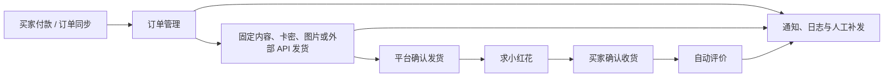

# XianYuPlus

<p align="center">
  <strong>私有部署的闲鱼多账号运营助手</strong><br>
  商品、订单、卡券、发货、客服与通知，都在一个后台清晰管理。
</p>

<p align="center">
  <a href="https://github.com/najiuwanan511/xianyu-Plus/releases"></a>
  
  
  
  <a href="LICENSE"></a>
</p>

<p align="center">
  <a href="#快速开始">快速开始</a> ·
  <a href="#核心能力">核心能力</a> ·
  <a href="#订单与自动化状态">订单状态</a> ·
  <a href="#交流与反馈">交流反馈</a>
</p>

> XianYuPlus 与闲鱼平台无官方关联。请在使用前了解并遵守平台规则及所在地法律法规。

## 它解决什么问题

当账号、商品与订单变多后，真正麻烦的往往不是某一次发货，而是：订单是否已同步、内容是否已送达、平台是否已确认发货、卡密有没有重复使用、买家是否已经确认收货，以及异常发生后应该由谁处理。

XianYuPlus 把这些环节放到一套可查看、可追踪、可人工接管的工作台里。它适合本地或私有服务器部署，业务数据保留在自己的设备与数据库中。



## V2.2 稳定版重点

- 订单页明确区分：自动发货结果、平台确认发货状态、交易状态与评价状态。
- 买家尚未确认收货时，评价显示为灰色“待买家确认收货”；只有实际评价接口失败才显示红色“评价失败”。
- 发货、补发与自定义内容发送均保留记录，方便核对实际发送结果。
- 卡券管理支持固定内容、本地卡密、图片内容和外部 API；多规格商品可按真实 SKU 指定独立卡密库和后台显示名。
- 卡券列表支持全选、批量删除、批量重置；发货中的卡券始终禁止操作。
- Cookie、WebSocket Token 与 H5 Token 状态集中查看，凭证更新后可通过通知渠道提醒。
- GitHub 版本页只展示当前保留的正式版本记录，后台更新说明与发布版本保持一致。
- 飞牛 OS 支持网页在线更新，宿主机代理负责备份、校验、重启与回滚，Docker 仍保持两个主要容器。

查看完整更新记录：[Releases](https://github.com/najiuwanan511/xianyu-Plus/releases) · [CHANGELOG](CHANGELOG.md)

## 核心能力

| 场景 | 能力 |
| --- | --- |
| 多账号 | 管理多个闲鱼账号，查看 Cookie、WebSocket、H5 Token 与连接状态。 |
| 商品管理 | 同步商品，配置商品级或多规格独立自动发货、回复、AI 与关键词规则。 |
| 订单管理 | 同步订单，查看买家、商品、交易、发货、评价和小红花的真实处理状态。 |
| 自动发货 | 支持固定文本、库存卡密、图片与外部 API 内容；可手动补发或确认发货。 |
| 卡券管理 | 卡密库存、固定内容、商品关联、库存预警、待核对处理和批量操作。 |
| 在线客服 | 集中查看会话，支持手动回复、买家标签、黑名单与人工接管。 |
| 自动化 | 支持确认发货后的小红花、买家确认收货后的自动评价，以及单笔人工补偿。 |
| 通知与排查 | 支持新订单、发货、异常、凭证更新通知；提供操作日志、实时日志与系统自检。 |

## 页面预览

| 账号与连接状态 | 订单管理 |
| --- | --- |
|  |  |

| 卡券与库存 | 通知渠道 |
| --- | --- |
|  |  |

## 快速开始

### Docker 部署

请先准备 Docker Engine（或 Docker Desktop）与 Docker Compose v2。

```bash
git clone https://github.com/najiuwanan511/xianyu-Plus.git
cd xianyu-Plus
chmod +x install.sh
./install.sh
```

安装脚本会创建 `.env`、生成运行所需密钥、构建镜像并启动 MySQL 与应用。完成后访问：

```text
http://你的设备 IP:12400
```

首次进入页面，按引导创建后台管理员账号即可。

### 更新已有部署

```bash
cd ~/xianyu-Plus
./update.sh
```

更新脚本会保留现有数据卷并重新构建服务。更新前如有重要业务数据，建议先完成备份。

### 飞牛 OS 网页在线更新

升级到 V2.2.5 或更高版本后，在项目目录执行一次：

```bash
sudo ./deploy/self-update/install-online-update.sh
```

安装完成后，可在页面顶部“版本详情”中点击“立即在线更新”。更新代理运行在飞牛 OS 宿主机的 `systemd` 中，不会增加 Docker 容器；Docker 仍然是应用和 MySQL 两个主要容器。

在线更新会自动下载 Release JAR、校验 SHA256、备份数据库与旧版本，并在当前自动化任务安全结束后重启应用。健康检查失败时自动恢复旧 JAR。`./update.sh` 继续保留为手动更新后备方式。

## 首次配置顺序

1. 在“账号管理”添加账号，确认 Cookie 与实时连接状态正常。
2. 在“商品列表”同步商品，并为需要处理的商品开启对应功能。
3. 如需自动交付，在“卡券管理”新建卡券库或固定内容，并关联商品。
4. 用测试商品走一笔小额订单，核对订单、发货内容和平台确认状态。
5. 配置通知渠道，确保新订单、发货异常和凭证更新能够收到提醒。
6. 确认流程符合预期后，再开启自动评价、小红花等后续动作。

## 订单与自动化状态

订单页将不同阶段分开显示，避免把“尚未满足条件”误认为故障：

| 状态 | 含义 | 建议操作 |
| --- | --- | --- |
| 待发货 | 买家已付款，尚未完成交付。 | 检查商品配置、卡券库存或手动发货。 |
| 已发货 / 已确认 | 发货内容已处理，平台已确认发货。 | 等待买家确认收货。 |
| 待买家确认收货 | 交易仍处于已发货阶段，评价尚未触发。 | 无需处理；确认收货后将自动评价。 |
| 已评价 | 买家确认收货后，评价已完成。 | 无需处理。 |
| 评价失败 | 已满足评价条件且平台接口实际返回失败。 | 在订单“更多操作”中补评价或查看日志。 |
| 待人工核对 | 平台未返回足够明确的结果，系统避免重复发送。 | 核对聊天与订单后，再选择补发或确认。 |

## 卡券与发货方式

一个卡券库可关联多个商品，并支持以下交付内容：

- **固定内容**：适合网盘链接、教程说明、统一售后文本等，不消耗库存。
- **本地卡密**：一行一条；发货后记录订单关联，避免重复取卡。
- **图片内容**：适合二维码、操作指引或图片资料。
- **外部 API**：按订单参数向供应商取卡；补发时优先复用已经领取的内容，减少重复请求。

卡券状态包括未使用、已使用、待核对和发货中。批量删除与批量重置会跳过“发货中”卡券，避免影响正在处理的订单。

## 凭证、连接与通知

- Cookie 用于账号身份与业务接口调用。
- WebSocket Token 用于实时消息与订单事件。
- H5 Token 用于部分网页接口能力。
- 凭证过期或自动续期结果可在账号详情查看；配置通知渠道后，异常与更新结果会推送提醒。

请妥善保管 `.env`、Cookie、Token、卡密及供应商密钥，避免提交到 GitHub 或发送给他人。

## 常用运维命令

```bash
# 查看服务状态
docker compose ps

# 查看应用日志
docker compose logs -f --tail=200 app

# 查看数据库日志
docker compose logs -f --tail=200 mysql

# 重新构建并启动
docker compose up -d --build

# 停止服务（不会删除数据卷）
docker compose down
```

业务数据存储在 Docker 数据卷中。除非已经确认完成备份，否则不要执行 `docker compose down -v`。

## 技术栈

- 后端：Java 21、Spring Boot、MyBatis-Plus、Flyway、MySQL
- 前端：Vue 3、TypeScript、Vite
- 部署：Docker Compose
- 实时连接：WebSocket

## 交流与反馈

部署完成后，欢迎交流使用体验、功能建议、问题反馈和可改进之处。

<table>
  <tr>
    <td width="50%" align="center"><strong>闲鱼交流微信群</strong></td>
    <td width="50%" align="center"><strong>赞赏支持</strong></td>
  </tr>
  <tr>
    <td width="50%" align="center">
      
    </td>
    <td width="50%" align="center">
      
    </td>
  </tr>
</table>

> 群二维码存在有效期；如失效，请通过 GitHub Issue 留言，我会补充新的二维码。

## 致谢与来源说明

XianYuPlus 在 [Evvvvvvvan/XianYuSmart](https://github.com/Evvvvvvvan/XianYuSmart) 的基础上持续迭代，并参考了社区项目在订单同步、自动评价、小红花和商品管理方面的实现思路。

感谢所有提供反馈、测试结果与改进建议的用户。

## 使用与许可

- 使用前请了解闲鱼平台规则，并自行承担账号与业务运营风险。
- 更新、迁移或重装前，请先备份重要数据。
- 本项目采用 [PolyForm Noncommercial License 1.0.0](LICENSE)，仅限非商业用途。
- 完整限制与免责声明请阅读 [DISCLAIMER.md](DISCLAIMER.md)。
